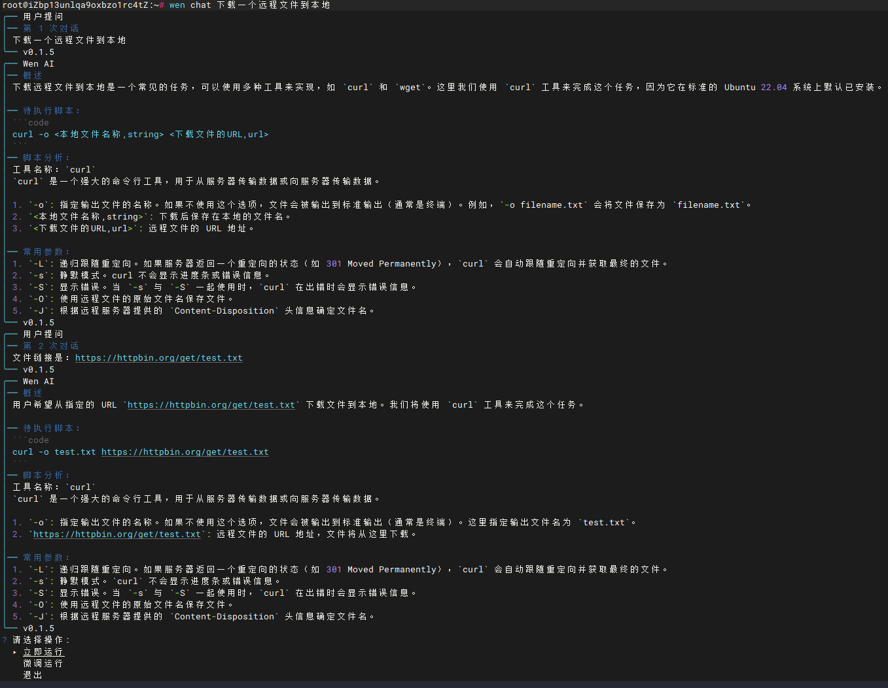

# 🤖 Wen AI CLI -- When you can't remember something, ask AI.

Wen AI is a CLI tool designed specifically for server operations and personal host management. By integrating AI capabilities, it helps users quickly find and execute system commands, improving operational efficiency. It can intelligently parse user requirements and provide precise command suggestions and execution solutions, making it an invaluable assistant for operation engineers.

## ✨ Features

- 🤖 Intelligent Dialogue: Support natural language conversations with AI to quickly find and apply commands
- 🔍 Smart Context Awareness: Intelligently perceives the current working environment for more accurate AI responses
- 🖥️ Cross-Platform Compatibility: Supports Linux, MacOS, Windows (arm, amd architectures) platforms
- 🌍 Multi-language Support: Built-in internationalization support, providing multi-language interface (currently supports Chinese and English)
- ⚙️ Configuration Management: Supports custom configuration, including API key settings
- 📝 Logging: Detailed logging for easy troubleshooting

## 📦 Installation

### 📋 Prerequisites

- Go 1.22 or higher
- Git

### 📝 Installation Steps

#### Method 1. 📦 Binary Installation
```bash
# One-line installation
# Install latest version
curl https://raw.githubusercontent.com/zdt1013/wen-ai-cli/main/install_en.sh | bash

# Install with specific version and mirror
curl https://raw.githubusercontent.com/zdt1013/wen-ai-cli/main/install_en.sh | bash -s -- -v v0.1.0 -m ghproxy
```
```bash
# Step-by-step installation
# Download installation script
curl -o install.sh https://raw.githubusercontent.com/zdt1013/wen-ai-cli/main/install.sh

# Add execution permission
chmod +x install.sh

# Run installation script (installs latest version by default)
sudo ./install.sh

# Or install specific version
sudo ./install.sh -v v0.1.0

# Install using acceleration source (available options: ghproxy, wgetla)
sudo ./install.sh -v v0.1.0 -m ghproxy
```

#### Method 2. 🚀 Local Compilation
1. Clone repository:
```bash
git clone https://github.com/zdt1013/wen-ai-cli.git
cd wen-ai-cli
```

2. Install dependencies:
```bash
go mod download
```

3. Build project:
```bash
go build
```

4. Add the compiled executable to system PATH (optional)

## 🚀 Usage

### ⌨️ Basic Commands

```bash
# Single question mode
> wen + enter any question
```


### 💬 Start Dialogue Mode
```bash
> wen chat + enter first question
or
> wen chat <enter>
  enter any question
```


### 🛠️ Other Commands
```bash
# View configuration
> wen config --help
# View help information
> wen --help
```

### 🔧 Configuration

Before using Wen AI, you need to configure necessary parameters, such as API keys. You can configure through the following commands:

```bash
> wen config --apiKey YOUR_API_KEY --baseUrl YOUR_API_BASE --model YOUR_API_MODEL
or
> wen config -k YOUR_API_KEY -u YOUR_API_BASE -m YOUR_API_MODEL
```

## 📁 Project Structure

```
wen-ai-cli/
├── action/     # Command action implementation
├── assets/     # Static resources
│   └── lang/   # Language packs
├── cmd/        # Command line definitions
├── docs/       # Documentation and attachments
├── common/     # Common components
├── execute/    # Executor
├── logger/     # Logging module
├── model/      # Data models
├── setup/      # Initialization setup
├── validate/   # Validator
├── wenai/      # Core functionality implementation
├── main.go     # Program entry
├── go.mod      # Go module definition
└── go.sum      # Go module dependency verification
```

## ⚠️ Known Issues
  * Non-command line related question responses, reply style not yet optimized

## 🔮 Future Plans
 * Manual mode: wen man
 * Awareness: Running host user, non-sudo user, intelligent command adjustment
 * Awareness: Installed and uninstalled commands on local machine
 * Tool chain (functioncall, mcp) support
 * Thinking model compatibility
 * User system for easy installation and use without manual AI parameter configuration
 * User knowledge base and preferences for saving usage habits, making Wen AI understand you better

## 📚 Dependencies on Open Source Projects
 * [urfave/cli](https://github.com/urfave/cli) - Command line application framework
 * [cloudwego/eino](https://github.com/cloudwego/eino) - ByteDance's open-source Large Language Model (LLM) application development framework
 * [gookit/config](https://github.com/gookit/config) - Configuration management library
 * [gookit/i18n](https://github.com/gookit/i18n) - Internationalization support
 * [shirou/gopsutil](https://github.com/shirou/gopsutil) - System information collection
 * [sashabaranov/go-openai](https://github.com/sashabaranov/go-openai) - OpenAI API client
 * [gookit/slog](https://github.com/gookit/slog) - Logging library
 * [go-cmd/cmd](https://github.com/go-cmd/cmd) - Command execution library
 * [manifoldco/promptui](https://github.com/manifoldco/promptui) - Interactive command line interface

## 🤝 Contribution Guidelines

Welcome to submit Issues and Pull Requests to help improve this project. Before submitting code, please ensure:

1. Code complies with project coding standards
2. Necessary tests have been added
3. Related documentation has been updated

## 📄 License

This project is licensed under the MIT License - see the [LICENSE](LICENSE) file for details

## 📞 Contact

If you have any questions or suggestions, please contact through:

- Submit an Issue
